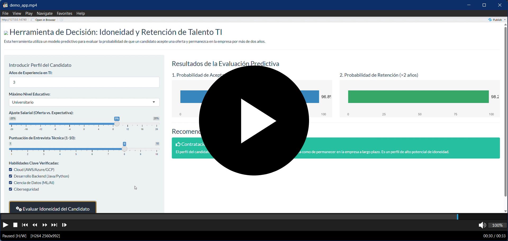

# Modelo Predictivo de Idoneidad y Retención de Talento TI

**Proyecto:** 7 \| **Autores:** Gutierrez Fernandez, Jesus Osmar y Marcelo Porcayo, Tonancy Lizahaya \| **Estado:** Finalizado

## 1. Contexto y Objetivo del Proyecto

Este proyecto simula una consultoría para una firma especializada en estrategia de talento. El objetivo es superar los métodos de reclutamiento tradicionales basados en la intuición, utilizando ciencia de datos para construir un modelo que prediga qué perfiles del sector tecnológico están buscando activamente un cambio de empleo.

## 2. Preguntas Clave del Análisis

La investigación se centró en responder una pregunta fundamental para cualquier equipo de reclutamiento: \* ¿Cuáles son las características demográficas, educativas y de experiencia que nos permiten identificar a los candidatos con mayor probabilidad de estar abiertos a una nueva oferta laboral?

## 3. Metodología Aplicada

Se analizó un dataset de Kaggle con más de 19,000 perfiles de TI. La metodología incluyó: \* **Análisis Exploratorio de Datos (EDA)** para identificar patrones y segmentos clave. \* **Construcción de un Modelo Predictivo** (Regresión Logística) utilizando el framework `tidymodels`. \* **Manejo de Desbalance de Clases** con la técnica SMOTE para asegurar que el modelo aprendiera de manera justa sobre el grupo minoritario (candidatos que sí buscan empleo).

## 4. Hallazgo Principal

El predictor más potente no es una variable aislada, sino la **intersección entre los años de experiencia y la relevancia de la misma**. Esto nos permitió definir cuatro segmentos de talento con comportamientos muy distintos. El modelo predictivo final demostró ser una herramienta robusta, alcanzando un **Área Bajo la Curva (AUC) de 0.777**, lo que indica una buena capacidad para distinguir entre candidatos activos y pasivos.

## 5. Estrategia Propuesta (ROI)

Basado en los hallazgos, se propuso una **"Estrategia de Talento de Tres Velocidades"** para maximizar el ROI del cliente: 1. **Motor Operativo:** Un proceso de atracción masiva y eficiente para los perfiles Junior y en Transición. 2. **Núcleo de Especialistas:** Campañas de atracción enfocadas en el desarrollo y los retos para el "Talento Relevante Joven". 3. **Eje de Liderazgo:** Hunting quirúrgico y personalizado para atraer al talento Senior, que es más pasivo.

## 6. Demostración de la Herramienta Interactiva

A continuación se muestra una demostración de la herramienta de decisión interactiva. Haz clic en la imagen para ver el video completo en acción. El código fuente de esta herramienta es propiedad intelectual y no se encuentra en este repositorio público.

El reporte visual completo, con los hallazgos y la estrategia propuesta, se puede consultar en la siguiente página web:

[**Visualizar el Reporte Interactivo Completo aquí**](https://psicosmarg.github.io/MODELO-IDONEIDAD-Y-RETENCION-PERFILES-TI-2025/)
